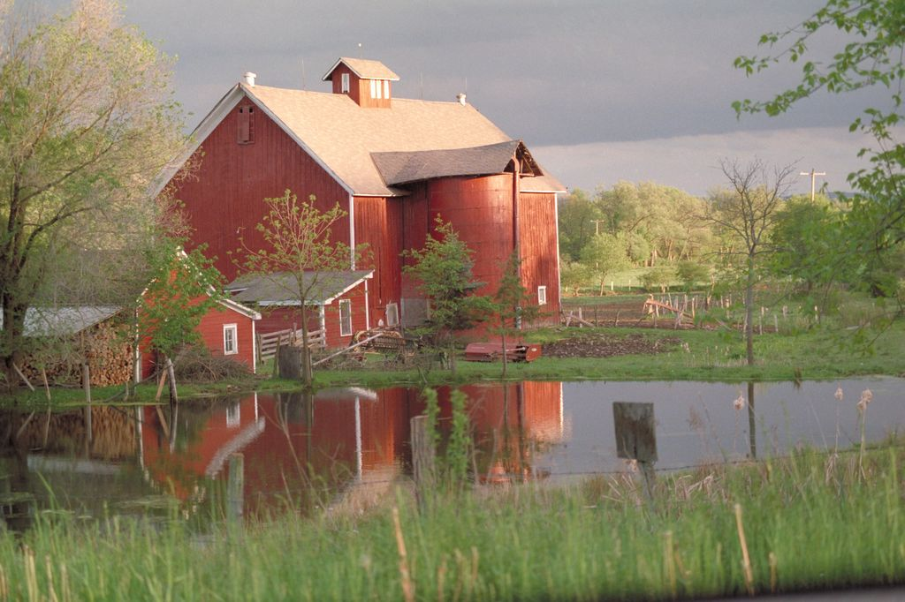
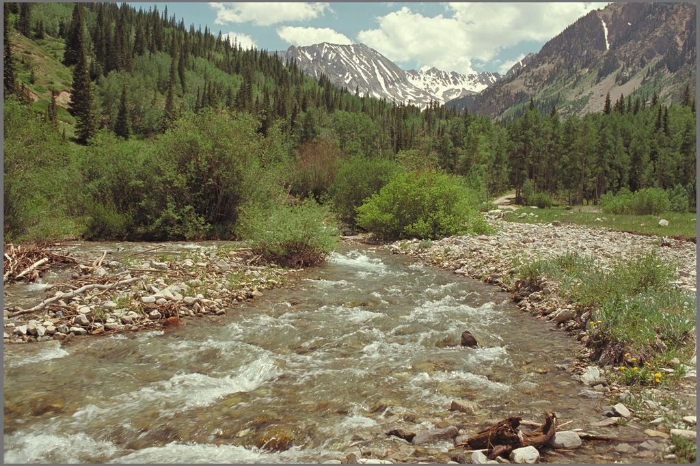

deep_dream
==========

An implementation of the Deep Dream image processing algorithm which is able to process large (wallpaper-sized) images despite GPU or main memory limits. It is also able to use multiple processes to take advantage of several CPUs and/or GPUs.

This implementation of Deep Dream is able to divide the gradient ascent step into tiles if a too-large image is being processed. By default, any image larger than 512x512 will be divided into tiles no larger than 512x512. The tile seams are obscured by applying a random shift on each gradient ascent step (this also greatly improves the image quality by summing over the translation dependence inherent to the neural network architecture). Further, several tiles can be processed simultaneously on machines with more than one compute device (CPU or GPU).

1. [Usage](#usage)
1. [Example](#example)
1. [CNN.dream_guided() example](#cnndream_guided-example)
1. [Models](#models)
1. [Pre-built Amazon image](#pre-built-amazon-image)
1. [Requirements](#requirements)
1. [Python 3.5 build tips](#python-35-build-tips)

Usage
-----
```
Usage: deep_dream_cli.py [OPTIONS] IN_FILE [OUT_FILE]

  CLI interface to deep_dream.

Options:
  --cpu-workers INTEGER        The number of CPU workers to start.
  --gpus INTEGER_LIST          The CUDA device IDs to use.
  --guide-image TEXT           The guide image to use.
  --layers RE_LIST             The network layers to target.
  --max-input-size INTEGER...  Rescale the input image to fit into this size.
  --max-tile-size INTEGER      The maximum dimension of a tile.
  --min-size INTEGER           Don't use scales where the small edge of the
                               image is below this.
  --model TEXT                 The model to use. Valid values: GOOGLENET_BVLC,
                               GOOGLENET_PLACES205, GOOGLENET_PLACES365,
                               RESNET_50.
  --n INTEGER                  The number of iterations per scale.
  --per-octave INTEGER         The number of scales per octave.
  --smoothing FLOAT            The per-iteration smoothing factor. Try
                               0.02-0.1.
  --step-size FLOAT            The strength of each iteration.
  --tv-weight FLOAT            The per-scale denoising weight. Higher values
                               smooth the image less. Try 25-250.
  --help                       Show this message and exit.

```

Example
-------

```python
import deep_dream as dd
from PIL import Image

cnn = dd.CNN(dd.GOOGLENET_PLACES365, gpus=[0])
img = Image.open('kodim/img0022.jpg').resize((768, 512), Image.LANCZOS)
```


```python
out = cnn.dream(img, 'inception_4a/output', min_size=64, per_octave=4, n=8, step_size=0.5, smoothing=0.02)
dd.to_image(out).save('example_med.jpg', quality=85)
```


```python
out = cnn.dream(img, 'inception_4a/output', min_size=64, per_octave=4, n=12, step_size=1.2, smoothing=0.01)
dd.to_image(out).save('example_out.jpg', quality=85)
```


CNN.dream_guided() example
--------------------------

Input:  


Guide:  


Combined output:  


Gradient ascent was performed using layers `inception_(3a-b, 4a-e, 5a-b)/output`. This is a reasonable set of layers for `dream_guided()` to work well. Note that the input and the guide do not have to be the same size; the output will be the same size as the input.

Models
------

Locations of pre-trained `.caffemodel` files (run `get_models.sh` to automatically download them):

- [bvlc_googlenet](http://dl.caffe.berkeleyvision.org/bvlc_googlenet.caffemodel): tends toward visualizing abstract patterns, dogs, insects, and amorphous creatures.
- [googlenet_places205](http://places.csail.mit.edu/model/googlenet_places205.tar.gz): tends toward visualizing buildings and landscapes.
- [googlenet_places365](http://places2.csail.mit.edu/models_places365/googlenet_places365.caffemodel): newer than the places205-trained model, often more aesthetically pleasing output, tends toward visualizing buildings and landscapes.

Pre-built Amazon image
----------------------

[This AMI in us-west-2](https://us-west-2.console.aws.amazon.com/ec2/v2/home?region=us-west-2#LaunchInstanceWizard:ami=ami-98fc33f8) contains deep_dream with all dependencies preinstalled and built for Python 3.5, and all models downloaded. It should be launched in a g2.2xlarge or g2.8xlarge instance. These instance types have 1 and 4 GPUs respectively. You can use all four GPUs from `deep_dream_cli.py` or `deep_dream_test.py` by specifying the parameter `--gpus 0,1,2,3`.

Requirements
------------

- Python 3.5.
- [Caffe](http://caffe.berkeleyvision.org), built against Python 3.5. (See the [Python 3.5 build tips](#python-35-build-tips).) I would encourage you to use Caffe's nVidia GPU support if possible: it runs several times faster on even a laptop GPU (GeForce GT 750M) than on the CPU.
- The contents of `requirements.txt`. (`pip install -U -r requirements.txt`)
    - [openexrpython](https://github.com/jamesbowman/openexrpython) needs to be installed from git master instead of 1.2.0 from PyPI for optional OpenEXR export. (`pip install -U git+https://github.com/jamesbowman/openexrpython`)
- Pre-trained Caffe models (run `get_models.sh`; see [Models](#models) section).

Python 3.5 build tips
---------------------

You will need protobuf 3 (currently in beta) for its Python 3 compatibility: 2.x will not work! Check out [protobuf](https://github.com/google/protobuf) and build/install both the main protobuf package (C++/protoc) and the Python module in `python/`. Do this before attempting to build Caffe.

### Linux (Tested on Ubuntu 16.04 LTS)

- First see the [Ubuntu 15.10/16.04 installation guide](https://github.com/BVLC/caffe/wiki/Ubuntu-16.04-or-15.10-Installation-Guide) on the Caffe GitHub wiki.  
- Python 3.5 `Makefile.config` settings, with python3.5 installed via apt-get:

  ```make
  PYTHON_INCLUDE := /usr/include/python3.5m \
          /usr/local/lib/python3.5/dist-packages/numpy/core/include
  PYTHON_LIB := /usr/lib
  PYTHON_LIBRARIES := boost_python-py35 python3.5m
  ```
- I used openblas in this configuration. MKL is probably faster in CPU mode.

### OS X (Tested on El Capitan 10.11)

- Python 3.5 `Makefile.config` settings, with python3 installed through [homebrew](http://brew.sh):  

  ```make
  PYTHON_DIR := /usr/local/opt/python3/Frameworks/Python.framework/Versions/3.5
  PYTHON_INCLUDE := $(PYTHON_DIR)/include/python3.5m \
          /usr/local/lib/python3.5/site-packages/numpy/core/include
  PYTHON_LIB := $(PYTHON_DIR)/lib
  PYTHON_LIBRARIES := boost_python3 python3.5m
  ```
- This assumes you installed numpy with pip into the python3.5 system site-packages directory. If you're in a virtualenv this may change.
- Leave the `BLAS` setting at `atlas`, unless you want to try MKL (faster in CPU mode). Recent OS X ships with an optimized multithreaded BLAS so there is little reason IMO to use openblas anymore.
